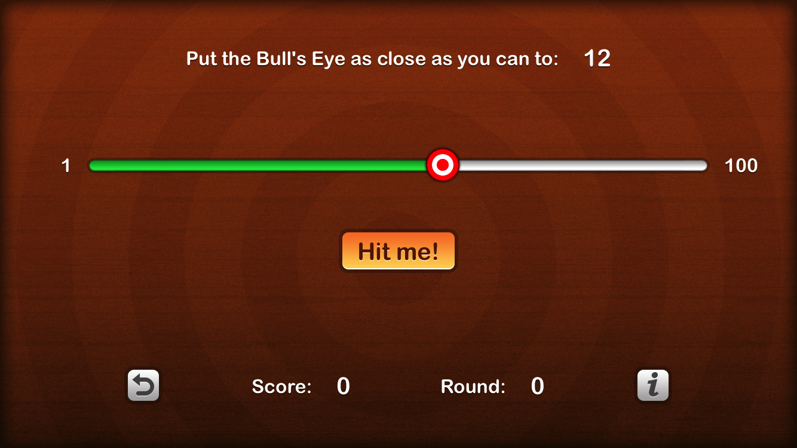

# Bull's Eye

This small game has been built to demonstrate some basic feature of React Native framework.
We have tried to create reusable components to build the main user interface.

We make use of functional components and class based components, proptypes, component's state and props, value passing from parent to child.

The example is inspired by the app built in the first chapter of the iOS Apprentice Book, published by Ray Wenderlich.

### Artwork license
Artwork/images/designs: from iOS Apprentice book, available at www.raywenderlich.com

